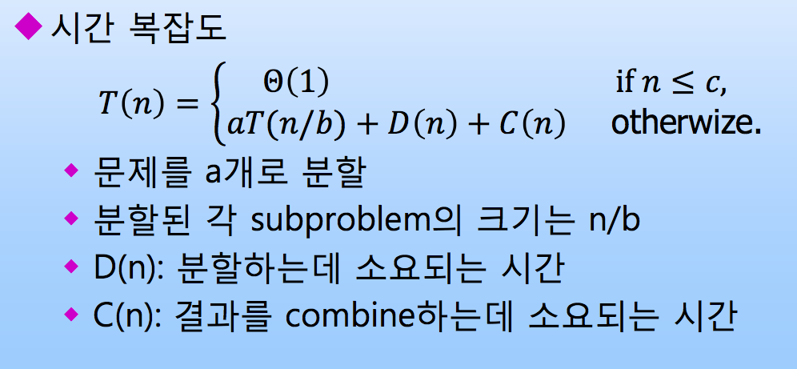

# 자료구조 알고리즘 2

### 1. Loop invariant를 이용한 알고리즘 증명 방법에 대해서 간략하게 설명하시오.
loop invariant는 loop가 진행되더라도 변하지 않는 불변 특성이다. loop가 들어간 알고리즘의 correctness를 증명하기 위해 사용된다.
induction의 한 종류로 다음의 특징을 만족해야 한다. 
 
 1. initialization  
 loop 초기진입 시점에 loop invariant가 참이다.
 2. Maintenance		
 반복 수행전 loop invariant가 참이었다면, 반복 수행 후에도 loop invariant가 참이어야 한다.	
 3.	termination		
 loop를 다 돌고서 loop invariant가 알고리즘의 correctness를 증명하는데 도움이 되어야한다.
  
### 2. Divide-and-conquer 전략에 대해서 간략하게 기술하시오.
주어진 문제를 동일한 종류의 작은 문제로 분할해 문제 분할 과정을 재귀적으로 처리하여 답을 구하는 전략이다. 

 1. Divide
 주어진 문제를 동일한 종류의 작은 문제들로 나눈다.
 2. Conquer
 문제가 충분히 작아졌을 땐 직접적으로 해를 구한다.
 3. 합치는 과정
 작은 문제들의 해를 이용해 주어진 문제의 해를 구한다.
 

### 3. Heap 자료구조의 특징과 장단점에 대해서 간략하게 기술하시오.
Max Heap
각 노드의 값이 그 노드의 children 노드의 값보다 크거나 같은 complete binary tree.
(Min Heap 이라면 작거나 같은 complete binary tree)

- 장점
	1. max heap에서는 최대값, min heap에서는 최소값을 Θ(1)의 시간 복잡도로 구할 수 있다.
    2. heap sort는 추가 공간을 Θ(1)정도 필요로 하는 in-placement sorting 알고리즘이다.
    3. 배열을 이용해 구현하면 children node 값을 Θ(1)의 시간복잡도로 찾을 수 있다.
- 단점
	1. node를 삽입하거나 추출할 때 삽입(추출) 후에 max-heap 유지를 위한 추가과정이 필요하다.
    2. serach 에는 적합하지 않다.
    
### 4. Priority queue에 대해서 간략하게 기술하시오.
cpu에게 job을 할당하는, job scheduling 기법의 하나로 우선순위가 높을수록 먼저 cpu에 할당시킨다. max-heap 자료구조를 이용하여 구현할 수 있다.
우선순위 값이 최대인 것은 언제나 root-node 이므로, 가장 우선순위가 높은 job을 쉽게 찾을 수 있다.

### 5. What are the minimum and maximum numbers of elements in a heap if height h?
간략한 답안 <br>
최소값은 1 + 2 + … + 2h-1 + 1 = 2h <br>
최대값은 1 + 2 + … + 2h = 2h+1 - 1

```java
void int fibonacci (int n) {
	int finonacciArr[n+1];
    int idx;
    fibonacciArr[0] = 0;
    fibonacciArr[1] = 1;
    for(idx=2; idx<n+1; idx++) {
     fibonacciArr[idx] =
     	fibonacciArr[idx-1] + finoacciArr[idx-2];
    }
    return fibonacciArr[n];
}
```